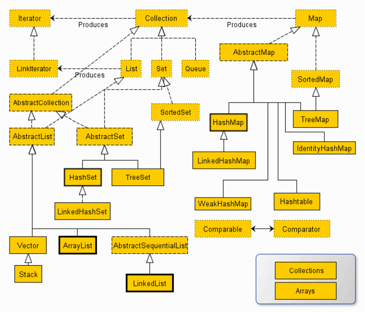

父类引用如何在运行时动态绑定子类对象，java 实现多态的原理?


# 关键字

 finalize在被JVM回收时会进行判断：

1、如果此对象finalize未被执行过，则执行，并放置此对象到F-Queue中，此时，若在下次GC之前，重新与GC ROOTS建立引用连接，则对象"复活",下次GC时如果此对象又被GC，则直接进行回收，因为finalize只执行一次。

2、如果此对象finalize已经执行过一次，则在GC时不执行finalize，直接回收


| 代码块             |                                                              |
| ------------------ | ------------------------------------------------------------ |
| 局部代码块(普通块) | 方法内{ }中的代码, 用于限制局部变量的作用范围                |
| 静态块:            | 类内static { }中的代码, 只在==类加载==的时候执行一次, 用于执行一些全局初始化操作, 如创建工厂, 数据库初始化 |
| 构造块             | 类内{ }中的代码, 每次创建对象时执行, 在构造函数之前          |
| 同步块             |                                                              |


| 内部类                                                       |      |
| ------------------------------------------------------------ | ---- |
| 局部内部类是放在代码块或方法中的, 不能有访问控制修饰符, 不能static |      |
| 局部内部类和匿名内部类只能访问局部final变量                  |      |


| final关键字  | final告诉编译器, 数据是衡定不变的. static final相当于占据一段不能改变的存储空间, 如果不赋初值的话编译器报错. |
| ------------ | ------------------------------------------------------------ |
| 基本数据类型 |                                                              |
| 引用类型     | 地址不能变, 但是对象中的属性可以变                           |
| 方法         | 方法不能被重写                                               |
| 方法参数     | 不能再用=                                                    |
| 修饰类       | 类不能被继承                                                 |

编译器常量指编译器可以将常量值代入到任何可用的计算式, 可以在编译时执行计算式, 减轻运行负担, 必须是基本数据类型.


| 某些关键字                    |      |
| ----------------------------- | ---- |
| `transient`, 表示不可被序列化 |      |
| `yield`, 指定switch的返回值   |      |


**权限修饰符**

说的是文件位置

- default(不写, 兄弟类也就是在同一个包下): 同一个包(同一个文件路径)
- `protected`(兄弟类和子类): 不同包的子类

| 修饰符    | 本类 | 本包                      | 其他包子类                  | 其他包非子类 |
| --------- | ---- | ------------------------- | --------------------------- | ------------ |
| private   | √    | ×                         | ×                           | ×            |
| 默认      | √    | √（本包子类非子类都可见） | ×                           | ×            |
| protected | √    | √（本包子类非子类都可见） | √（其他包仅限于子类中可见） | ×            |
| public    | √    | √                         | √                           | √            |


**Object类**

- `toString( )`
- `equals( )`, 引用类型存的是地址, 两个对象地址一定不同; equals()实现属性的比较
- `hashCode( )`


# 面向对象

|                   |                                                              |
| ----------------- | ------------------------------------------------------------ |
| 构造器            | 所有构造器的第一行系统自动分配`super()`, ; 如果写了`super(x, ...)`或者`this(x, ...)`就不自动分配了 (构造器中, `super()`和`this()`只能存在一个) |
| 属性继承          | 属性不会被重写覆盖, 子类可以定义与父类重名的属性             |
| 多态              | 多态和属性无关, 多态指的是方法的多态; `Animal animal = new Cat();` =左侧: 编译期类型, 也就是说写代码的时候不能使用父类没有的子类方法; =右侧: 运行期的类型, 运行的时候执行的是子类重写过的父类方法; 多态情况下, 子类中具有父类同名的属性和方法, 使用的是父类的属性 |
| 抽象类抽象方法    | 抽象类可包含0-n个抽象方法                                    |
| 接口:可理解为父类 | 公共静态常量默认有`public static final` 接口是标准规范, 所以属性都是==静态常量==; 抽象方法默认有`public abstract`; 默认实现方法 用`default` 修饰 |


# 异常Exception

不对RuntimeException处理, 这种异常是程序本身的逻辑错误导致的

- `catch`捕获异常后,==try-catch后面的代码继续执行==, 但try中后续的代码不执行
  - catch中出现异常则try-catch后的代码不会执行, 所以需要finally

- `finally`, 无论如何finally内的代码都会执行, 除非遇到` System.exit(0)`停止虚拟机; 一般关闭数据库资源、关系IO流资源、关闭socket资源会用到finally
- ` throws`, 甩锅给调用我的方法, 后面加异常的类型
- `throw`, ==制造==异常, 后面加对象` throw new RuntimeException("性别不对!")`

自建异常是为了通过异常的名称直接判断异常出现的原因


**如何统计redis操作失败的次数?**

1. redisTemplate, try ... catch ... catch捕获一次就失败一次


**有没有自定义异常? 为什么要自定义异常?**


# 字符串

**字符串String**

可变不可变: 在地址不变的情况下, 字符串能不能变

`String s = new String("abc")`时, s指向堆中开辟的空间, s的`byte[] value`属性指向字符串常量池中的`“abc”`对象

 `String s = "abc"`时, s指向字符串常量池中的一个地址, 常量池中若没有abc则创建一个

<u>疑问:  str="abc"时, String对象创建的byte[] value数组在哪里?</u>

- 不可变字符串String: 每次创建String对象都指向常量池里的一个字符串, 当String值改变, String对象指向另一个常量池的字符串
- 可变StringBuilder, StringBuffer(线程安全, 效率低)


# 注解

注解其实就是做标记.

为什么要有注解? 现在有个需求, 要为某些类创建实例并且放入工厂的容器中, 怎么实现? 可以使用注解为这些类做个标记.


<u>基本注解</u>

Java的原生注解: @Overried, @FunctionalInterface, 用于标记检查

<u>元注解</u>

元注解是用于修饰其他注解的注解

- Retention, 指定注解的<u>生命周期</u>.
  - `Retention.SOURCE`源文件保留, 编译了就没了. 编译器直接丢弃, 在编译后的.class文件不会保留
  - `RetentionPolicy.CLASS` 编译后还有, 运行时就没了. class保留, JVM直接丢弃, 但是运行时不会继续加载, 是默认状态
  - `RetentionPolicy.RUNTIME` JVM保留,  运行时还有, 加载在内存, 程序可通过反射获取该注解
  
- Target, 指定注解能<u>修饰哪些元素</u>

  - TYPE表示可以修饰类
  - FIELD修饰属性
  - METHOD修饰方法

- ~~Documented(很少), 指定注解被javadoc提取成文档, 默认javadoc不包括注解~~

- ~~Inherited(极少), 指定注解具有继承性, 如果某个类使用了被@Inherited修饰的注解, 则其子类将自动具有该注解~~

注解如果只有一个属性并且名字为value, 为属性赋值时可以不写属性名.


<u>lombok原理</u>

将.java文件编译成.class文件之前会解析注解, 如果想在编译期间处理注解相关的逻辑, 需要继承AbstractProcessor并且实现process() 没懂


<u>自定义注解</u>

需求: 我们需要在业务代码中的50个类的方法中, 统计一些指标(QPS, RT(运行时间)和错误)上报给监控系统. 

不用任何设计的话, 那就只能在这几百个方法中都插入同样的代码, 有大量的重复代码, 而且业务代码和监控代码混在一起.

解决方式就是 Spring AOP + 自定义注解

自定义一个注解@Monitor, RUNTIME + METHOD, 用这个注解标记这个方法需要 增强监控的功能; 用Spring AOP实现有 @Monitor 的方法的前后加上监控的逻辑.

```java
@Aspect
@Component
public class MonitorAspect {

    @Pointcut("@annotation(com.example.Monitor)")
    public void monitorPointCut() {}  // 定义切入点的名字, 带有@Monitor的方法都属于monitorPointCut()切点

    @Around("monitorPointCut()")  // 将monitorPointCut()切点的所有方法都扩展成aroundAdvice()的逻辑
    public Object aroundAdvice(ProceedingJoinPoint joinPoint) throws Throwable {

        // 日志...
        // RT...
        Object o = null;
        try {
            o = joinPoint.proceed();  // 调用被代理对象的方法
        } catch (Exception e) {
            // RT...
            // ERROR...
            throw e;
        }

        // RT...
        return o;
    }
}
```


# 枚举

**枚举enum**

- 枚举类提供有限的确定的对象

```java
public enum Season implements TestInterface {
    SPRING("spring", "春") {
        @Override
        public void test() {
            System.out.println("spring");
        }
    },
    SUMMER("summer", "夏") {
        @Override
        public void test() {
            System.out.println("summer");
        }
    },
    AUTUMN("autumn", "秋"),
    WINTER("winter", "冬");

    private final String seasonName;
    private final String seasonDesc;

    Season(String seasonName, String seasonDesc) {
        this.seasonName = seasonName;
        this.seasonDesc = seasonDesc;
    }

    @Override
    public void test(){
        System.out.println("season");
    }

    @Override
    public String toString() {
        return "main.Season{" +
                "seasonName='" + seasonName + '\'' +
                ", seasonDesc='" + seasonDesc + '\'' +
                '}';
    }

}
```

- 使用

```java
Season spring = Season.SPRING;  // 获取对象
Season[] seasons = Season.values();  // 获取所有对象
Season.valueOf("SPRING");  // 根据对象名获取对象
```

****

**包装类**

`xxx.valueOf()`会调用`parseXXX()`返回包装类

String --> 包装类: `Integer.parseInt(string)`, parseXXX返回基本数据类型

包装类 --> String: `String.valueOf()`(创建String对象), 或`String s = xx + ""`


# 集合

## 泛型< >

在创建对象或调用方法的时候才明确下具体的类型. 

一般集合中存放同一类型的数据, 以便于管理, 泛型可以在编译层面, 也就是写代码时对数据类型进行限制

泛型方法: 方法的泛型和当前类的泛型无关, 不是带泛型的方法就是泛型方法; 看前面有没有\<T>

```java
public class TestGeneric<E> {
    public <T> void func1(T t) {
      // T的类型在调用方法的时候确定
    }
}
```


(看不懂)

自己写组件的时候会用到泛型, 案例: 要根据某些字段进行聚合, `select sum(column1),sum(column2) from table group by field1,field2`. 

需要 sum 和group by 的列肯定是由业务方自己传入, 而SQL的表的一条记录就是一个POJO实例(传入的字段也肯定是POJO的属性)

可以在参数上写死POJO这就只能适配一个表, 所以把入参设置为泛型

拿到参数后，通过反射获取其字段具体的值，做累加

```java
// 传入 需要group by 和 sum 的字段名
public cacheMap(List<String> groupByKeys, List<String> sumValues) {
  this.groupByKeys = groupByKeys;
  this.sumValues = sumValues;
}

private void excute(T e) {
  
  // 从pojo取出需要group by的所有字段
  List<Object> key = buildPrimaryKey(e);
  
  // primaryMap 是存储结果的Map
  T value = primaryMap.get(key);
  
  // 如果从存储结果找到有相应记录
  if (value != null) {
    for (String elem : sumValues) {
      // 反射获取对应的字段，做累加处理
      Field field = getDeclaredField(elem, e);
      field.set(value, (Integer) field.get(e) + (Integer) field.get(value));
    }
  } else {
    // group by 字段 第一次进来
    primaryMap.put(key, Tclone(e));
  }
}
```


## 通配符 ?

给范型也整个父类

G<?>是G<A\>和G<B\>的父类 

```java
String[] stringArr = new String[10];
Object[] objArr = stringArr; // 多态的一种形式

List<String> stringList = new ArrayList<>();
// List<Object> objList = stringList;  代码报错,A和B是父子关系, 但G<A>和G<B>不存在继承关系; 因为这行一旦成立, objList和stringList指向同一个地址, 则objList可以往里添加String意外的类型, 导致与泛型矛盾

List<?> objList2 = new ArrayList<>();
objList2 = stringList;
```


## 泛型受限

```java
// 泛型受限
List<Object> objectList = new ArrayList<>();
List<Person> personList = new ArrayList<>();
List<Student> studentList = new ArrayList<>();

// 泛型的上限：List<? extends Person> ≤ 是List<Person>的父类，同时也是List<Person的子类>的父类
List<? extends Person> list1;
// list1 = objectList; 报错
list1 = personList;
list1 = studentList;

// 泛型的下限：List<? super Person> ≥ 是List<Person>的父类，同时也是List<Person的父类>的父类
List<? super Person> list2;
list2 = objectList;
list2 = personList;
// list2 = studentList; 报错
```


## UML

- 关联关系: A的一个属性是B
  - 关联关系:单向关联: ==箭头实线==, 指向B; 双向关联: A的一个属性是B,B的一个属性是A, ==不带箭头实线==;自关联:A的一个属性是A,如链表
  - 聚合关系: 整体和部分的关系, 如大学包含多个老师, 汽车的引擎和轮胎, ==空心菱形实线==, 菱形在大学那边
  - 组合关系, 如订单与订单项, 如果订单消失, 订单项就没有意义,  ==实心菱形实线==, 菱形在订单那边
- 依赖关系: A的方法中使用了B, ==箭头虚线==, 指向B
- 继承(泛化)关系: 耦合度最大的关系, 父类变, 全都变. ==空心三角实线==, 箭头指向父亲
- 实现关系: 接口与实现类的关系. ==空心三角虚线==, 指向接口


## 集合



集合要求元素一定重写equals()方法, 因为一些方法要调用, 如contains(), remove()	

集合分两大阵营:
- Collection阵营, 一个一个存
  - List
  - Set: 
    - HashSet: 放入HashSet中和LinkedHashSet一定要对`hashCode()`和`equals()`重写(两者共同实现唯一, 用hashCode计算存储位置, 再比对hash值, 再比对equals, 若两个都相同则认为相同, 若有一个不相同则不相同; 计算hashcode的方式若非常简单是有可能导致对象不同但hashcode相同的, 因此也需要比对equals); ==用HashMap实现==
      - LinkedHashSet
    - TreeSet: (不考虑hashCode和equals, 比较器的返回值是0则是同一个元素)存储方式是红黑树; 自建类实例一定要实现` Comparable<>`接口,  没实现则要用有参构造器指定外部比较器; 用TreeMap实现
- Map阵营
  - HashMap
    - LinkedHashMap
  - TreeMap
  - HashTable
    - Properties: 接收配置文件的内容


# HashMap

## HashMap的实现原理

​	首先, HashMap是用来干啥的? 我们希望快速的从HashMap查找数据并访问, 要多快? O(1)的时间复杂度. 所有==查找算法==中, 能够到达O(1)的那就是==Hash查找算法==. 所以HashMap其实就是维护了一个数组, 这个数组的每一格存储的是什么东西? <font color='red'>Node</font>对象, Node是==单链表的结点==, 有个属性是Node类型的, 用来指向单链表的下一个结点, Node里面的Kay和Value就是我们所使用的Key和Value.

> **查找算法**: 1.哈希查找; 2.二分查找; 3.树查找(二叉搜索树, 红黑树, AVL树, B树, B+树)
>
> **Hash查找算法:** Hash查找算法是根据元素, 计算出一个==hashcode==, 再根据这个hashcode来算出元素的存储位置
>
> **单链表结构:** 用来解决hash冲突, 链表的长度超过8时, 变为红黑树
>
> **hashcode():** hashCode()根据对象的内存地址计算哈希值，, 但如果需要根据对象的内容生成哈希值, ‌就需要重写hashCode(), hashCode()得出的范围是有限的，‌而对象的属性是无限的，‌因此‌不同的对象可能会计算出相同的hashCode值


## get(key) put(key, value)的过程

1. 先根据key计算出hashcode
2. 在==根据hashcode计算出key在数组的位置==
3. 单链表顺序搜索或者红黑树搜索
   - 如果要put, 则进行尾插法

> **根据hash得出位置**需要经过两次哈希:
>
> 1. 将hash右移16位 再 和自己异或(利用到高位的数字充分散列)
> 2. key的hashCode & (数组长度-1), 得出存储的位置
>    - 为什么不用取位操作? 因为如果要扩容取的位数就不一样, 还要单独存储要取多少位的变量


## HashMap一般用什么作key?

String重写了`hashCode()`和`equals()`方法

String‌作为key时, 因为String==不可变==, 避免因为对象的修改导致哈希值变化, 从而影响查找结果

> 不可变: 不可变对象是该对象在创建后它的哈希值不能改变


## HashMap的扩容机制

​	HashMap什么时候开始扩容?  在链表要转红黑树时, 如果数组小于64, 扩容. 当有 capacity * 0.75 个元素的时候, 就扩容, capacity一开始是16. 每次==扩为原来的两倍==

​	扩容之后, 要对之前的元素进行迁移, 如果只有值没有链表, 则位置不变; 如果有链表, key的hashCode & 旧数组的长度, 如果结果是0，那么当前元素的桶位置不变。如果结果为1，那么桶的位置就是原位置+原数组长度; 如果是树, 位置不变.

> **HashMap容量为什么一定是2的n次方?** 2的n次幂 -1的结果是0后面全是1, 这样才能和hashCode与运算得出存储位置


## 为什么要用红黑树? 而不用AVL, B树?

红黑树更加适合修改密集任务, AVL跟红黑树相比, 要保证绝对平衡, 修改操作比较复杂

红黑树一般存的结点数不会太多, B树的构建代价比较大


> ## HashMap
>
> 1. key允许key和value为null值
>2. HashMap扩容机制
>    - 1.7: 生成新数组, 用每个元素的key基于新数组⻓度, 计算出每个元素在新数组中的下标
>    - 1.8: 
>      - 只有值(没有链表): 迁移位置不变
>      
>      - 链表: key的hashCode & 旧数组的长度, 如果结果是0, 那么当前元素的桶位置不变; 如果结果为1, 那么桶的位置就是原位置+原数组长度.
>      - 红黑树: 所有数据取出来重新拼接成新的树, 位置不变
>
> 
>
> 
>HashMap1.7与1.8的区别
>
> 1. 1.8增加红黑树
>2. 1.7链表插⼊是头插法(有产生环的问题), 1.8链表插⼊是尾插法. 因为1.8插⼊key和value时需要判断链表元素个数, 所以要遍历链表统计链表元素个数, 正好就直接使⽤尾插法.
> 3. 1.7先判断是否需要扩容, 1.8先插入再扩容
> 4. 1.7中哈希算法⽐较复杂, 存在各种右移与异或运算; 1.8中进⾏了简化, 因为复杂的哈希算法的⽬的就是提⾼散列性, 来提供HashMap的整体效率, ⽽1.8中新增了红⿊树, 所以可以适当的简化哈希算法, 节省CPU资源
> 
> 
>
> **HashMap和HashTable的区别**
>
> 1. HashTable ==线程安全==, synchronize所有方法, 效率低
>2. HashTable的key和value都不允许为null
> 


# Java IO

**IO流**

IDEA中, 文件目录在单元测试是相对module, main方法是相对project

IO流理解为一根管道, 作为程序和数据源沟通的桥梁

- 字节流: InputStream, OutputStream; 用来操作非文本文件
- 字符流: Reader, Writer; 用来
- InputStreamReader 将字节流转换为字符流

处理流:

- 缓冲流: 可以提升速度, 为了减少对硬盘的IO次数, 先用将数据一次性读入内存的缓冲区1, 再进行写, 写到缓冲区2, 再将数据一次性写入硬盘
  - BufferedInputStream, BufferedOutputStream; BufferedReader, BufferedWriter
  - 如果处理流包裹着节点流, 那么只需关闭高级流(处理流), 里面的字节流也会随之被关闭
- 转换流: 后缀表示是字符流, InputStreamReader, OutputStreamWriter
- 对象流: ObjectInputStream,  ObjectOutputStream


# 序列化和反序列化

序列化: 把内存中的Java对象转换成平台无关的二进制数据, 保存在磁盘上或网络传输

反序列化: 把获取二进制数据恢复成Java对象

实现Serializable接口(标识接口)的类都要有一个序列号: `public static final long serialVersionUID = xxxL`表示版本(一个对象被写在磁盘中后, 对应的类改变了, 不设置序列号的话读入就会报错), 修改类的时候serialVersionUID会变化

被`satic`或`transient`修饰的属性不可被序列化


# 反射

获取Class对象

- 全类名加载 `Class<?> clazz = Class.forName("xxx.xxx.Xxx")`, 适合根据配置文件中的驱动类名动态加载对应的驱动类。
- `Class<?> clazz = Xxx.class;`
- `Class<?> clazz = instance.getClass();`


反射可以在运行时获取类的信息, 那我们为什么要在运行时获取类的信息? 

一个好用的工具需要兼容各种情况, 工具不知道你传的是什么对象, 所以需要运行时去获取你传的对象的信息

例如Spring把有@Component的类都实例化.

SpringMVC, 在方法上写上对象, SpringMVC会帮我们将参数封装到对象上, 那SpringMVC怎么知道方法的参数是什么类型, 所以要在运行时获取; 

再比如用Mybatis可以只写接口不写实现类, 就可以执行SQL, 用的是动态代理实现; 


泛型会被擦除, 也就是泛型的信息只存在编译阶段，在class字节码就看不到泛型的信息了, 反射为什么能获取到泛型的信息?

泛型擦除是有范围的，定义在类上的泛型信息是不会被擦除的。Java 编译器仍在 class 文件以 Signature 属性的方式保留了泛型信息. Type作为顶级接口，Type下还有几种类型，比如TypeVariable、ParameterizedType、WildCardType、GenericArrayType、以及Class。通过这些接口我们就可以在运行时获取泛型相关的信息。


# 面试笔试指南

**关于垃圾回收GC(Garbage Collection)**

Java的GC主要针对==堆==区, 方法调用时会创建栈帧在==栈==中, 调用完自动出栈释放, 所以在栈区中的方法调用就不会由GC释放

JVM内存可简单分为三个区: 

1. 堆
2. 栈: 存放基本数据类型的数据和对象的引用, 每个线程包含一个栈区(分虚拟机栈和本地方法栈)
3. 方法区(静态区): 包含的都是在整个程序中永远唯一的元素，如class，static变量, 字符串常量池(类信息、常量、静态变量、编译后的字节码); 是==线程共享==的(也被称为非堆, None-Heap)

程序员最多只能用System.gc()来==建议==执行垃圾回收器回收内存，但是具体的回收时间，是不可知的。当对象的引用变量被赋值为null，可能被当成垃圾。


**Java是值传递, 实参复制一份给形参**

判断一个引用类型变量传进方法中会不会变, 需要看方法中有没有直接对引用类型变量的地址的内容操作

<u>断言(不一定对): String传入方法无论怎么操作都不会变</u>

```java
String a = "a";
String b = "b";
 
String str1 = "a" + "b";//常量池中的对象
String str2 = a + b; //在堆上创建的新的对象     
```


**off-heap**

off-heap叫做堆外内存, 将对象从堆中脱离出来序列化, 然后存储在一大块内存中, 就像存在磁盘上一样, 但仍在RAM中. 对象在这种状态下不能直接使用, 他们必须先反序列化, 也不受垃圾收集.

序列化和反序列化将会影响部分性能（所以可以考虑使用FST-serialization）使用堆外内存能够降低GC导致的暂停。堆外内存不受垃圾收集器管理, GC只管堆，也不属于老年代，新生代

堆外内存，它和内存池一样，也能缩短垃圾回收时间，但是它适用的对象和内存池完全相反。内存池往往适用于生命期较短的可变对象，而生命期中等或较长的对象，正是堆外内存要解决的。


**包装类**

`valueOf()`操作-128 ~ 127之内的整型，在第一次引用，会在缓存中new一个对象；再次引用，直接从缓存中查找；操作-128 ~ 127之外的整型，则每次都要new一个对象


**内部类**

局部内部类和匿名内部类只能访问局部final变量

局部内部类是放在代码块或方法中的，就像方法里的一个局部变量一样, 不能有访问控制修饰符，且不能用static修饰


**多线程需要加锁的情况**

Java原子操作:

- 除long和double之外的基本类型的赋值操作, 

- 所有引用reference的赋值操作

  - >  在 Java 中，大多数基本类型的赋值操作都是原子操作，因为它们的大小可以在一个 CPU 指令周期内完成。然而，`long` 和 `double` 类型的变量需要 64 位来表示，这可能导致在某些处理器上（尤其是 32 位处理器）不能在一个 CPU 指令周期内完成赋值操作。 在这种情况下，`long` 和 `double` 类型的赋值操作可能会被拆分为两个 32 位操作，这样的操作是非原子性的。这意味着当一个线程正在执行赋值操作时，另一个线程可能会看到这个变量的部分值（一个操作完成的 32 位），从而导致不正确的结果。 不过，在实际开发中，大多数现代处理器和 Java 虚拟机都可以原子地处理 64 位的赋值操作。但是，为了确保线程安全，最好还是使用 `java.util.concurrent.atomic` 包中的原子类，如 `AtomicLong` 和 `AtomicDouble`（从 Java 8 开始提供）来处理 `long` 和 `double` 类型的变量。这些原子类可以确保在多线程环境中对这些变量的操作是原子性的，从而避免了潜在的线程安全问题。

- java.concurrent.Atomic.* 包中所有类的一切操作   


**`||`的短路特性: 前面为真则不运行后面**

`|`不短路


**volatile**

一个线程执行的过程有三个阶段: 加载（复制）主存数据到操作栈 -->  对操作栈数据进行修改  --> 将操作栈数据写回主存 

可以修饰变量, 只保证多线程操作的可见性，不保证原子性, 只保证线程在“加载数据阶段”加载的数据是最新的，并不能保证线程安全


**.clone()深拷贝**

用protected修饰clone方法，主要是为了让子类去重写它，实现深拷贝，以防在其他任何地方随意调用后修改了对象的属性对原来的对象造成影响。


# 面试题

## 如何统计Redis操作失败的次数?

1. redisTemplate的操作进行 try ... catch ... 捕获到一次是一次失败
2. 但是这样的话可能和业务耦合度较强, 所以可以用AOP.


## 异常

- Exception:
  - RuntimeException: 空指针, 数组越界, 除以0.
  - 非运行时异常: IOExecption, SQLException, ClassNotFoundException. 需要手动处理, 否则编译器报错.
- Error: OOM, StackOverflow. 系统级别错误.


