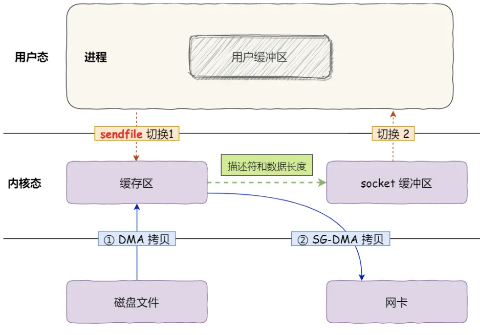

# CPU

## CPU缓存一致性与MESI

CPU读数据尽可能从CPU Cache读取.

CPU写数据写入Cache, 什么时候将其同步到内存? 1.写直达, 同时写Cache和内存; 2.写回, 只将脏的也就是修改过的Cache Block写回内存, 写内存的频率低, 从而效率高.但在多核情况下会出现每个CPU的数据不一致问题

写传播: 某个CPU核心更新了Cache, 要同步到其他核心的Cache.

事务串行化: 核心1将变量改为100再改为200, 事务串行化要保证核心2不会收到的是改为200再改为100的顺序. 需要做到1.CPU核心对于Cache的写操作需要同步给其他核心; 2.引入锁, 两个CPU的Cache有一个数据, 只有拿到了锁才能对其写操作.

总线嗅探实现写传播. CPU需要一直监听总线, 不论别的核心的Cache是否有相同数据, 都发出广播, 总线负担重. 且未实现事务串行化.

MESI协议: 基于总线嗅探实现事务串行化, 用状态机机制降低了总线压力.

| MESI标记CacheLine的四种状态 |                                   |
| --------------------------- | --------------------------------- |
| Modified已修改              | 脏的, 还没有写回内存.             |
| Exclusize独占               | 只在一个核心里的一致数据          |
| Shared共享                  | 在多个核心里的一致数据            |
| Invalidated已失效           | 别的核心修改了该数据, 就认为失效. |

Cache Line是已修改或者独占状态, 修改数据不需要广播给其他核心, 减少了总线压力.

## CPU中断

中断是用来响应硬件设备请求的机制. OS受到硬件中断请求, 会打断正在执行的进程, 调用内核的中断处理程序来响应请求.

中断处理程序在响应中断时, 还可能临时关闭中断. 此时其他中断请求都无法被响应, 也就是中断可能会丢失, 所以中断处理程序需要短且快.

Linux为了解决中断处理程序执行过长而导致中断丢失问题, 将中断分为两个阶段, 分别是上半部分和下半部分

- 上半部分 硬中断: 硬件设备需要CPU时, 通过中断控制器通知CPU. 用来快速处理中断, 暂时关闭中断请求, 负责处理硬件请求. 
- 下半部分 软中断: 程序调用INT指令. 内核线程异步处理剩余工作. 每个CPU对应一个软中断内核程序ksoftirqd/cpu编号.

网卡收到数据后, DMA将数据写入内存, 通过硬件中断通知内核, 内核调用对应的中断处理程序.

硬中断禁止网卡中断, 软中断的软中断处理程序负责 操作系统的网络子系统 对数据按照网络协议栈逐层解析和处理.

| 软中断                   | 硬中断              |
| ------------------------ | ------------------- |
| 中断服务程序对内核的中断 | 外部设备对CPU的中断 |
|                          |                     |
|                          |                     |
|                          |                     |

# 内存管理

进程想要访问一块空间, 如果直接访问物理地址的话会有很多问题, 所以程序中写的是虚拟地址, CPU中的内存管理单元MMU映射虚拟地址和物理地址.

内存分页一页是4K. 当进程访问的虚拟地址在MMU中不存在时, 会产生缺页异常, 切换内核态分配物理内存, 更新进程页表, 在回到用户态.

32位每个进程的虚拟地址空间有2^32^B=4GB.

64位每个进程的虚拟地址空间有2^64^B

## 内核缓冲区

在内核与用户空间或者IO设备之间传递数据时，内核缓冲区作为临时存储，确保数据完整性和高效传输。

## 虚拟内存

操作系统负责进程的虚拟地址和物理地址映射.

# 进程管理

**什么是僵尸进程?**

子进程退出后, 父进程编程错误未调用wait()回收其状态, 或者父进程阻塞/死循环, 或者忽略了子进程终止信号(SIGCHLD), 终止运行但是仍在进程表中的进程.

不占用内存和CPU, 但是占用PID; 在进程表中残留.

# 调度算法 -- 进程调度, 内存页面置换, 磁盘调度

# 文件系统

# 设备管理 -- 键盘敲a, 操作系统做了什么?

1. 键盘输入字符, 键盘控制器将数据写在键盘控制器的寄存器中;
2. 键盘控制器通过总线给CPU发送中断请求;
3. CPU收到中断请求, OS保存当前进程的上下文, 调用键盘的中断处理程序(键盘驱动程序初始化时注册);
4. 键盘的中断处理程序 从键盘控制器的寄存器中读取数据, 放入读缓冲队列.

# 网络系统

## 1 DMA

DMA(Direct Memory Access)直接内存访问: IO设备和内存的数据传输时, 数据搬运的工作全部给DMA, 而不是CPU. 每个IO设备都有自己的DMA.

### 没有DMA

一次磁盘IO, CPU需要拷贝两次

### 有了DMA

一次磁盘IO, CPU只需要拷贝一次.

## 2 零拷贝

场景: 需要从磁盘读文件, 发到网卡.

零拷贝指的是一次文件传输, CPU不需要参与拷贝. 不从内核态拷贝到用户态, 直接将数据从内核缓冲区放到网卡上.

Kafka, Nginx就利用了零拷贝技术.

### read() + write()

read(file, tmp_buf, len) + write(socket, tmp_buf, len)

1. DMA 磁盘 --> 内核缓冲区; 
2. CPU 内核缓冲区 --> 用户缓冲区; 
3. CPU 用户缓冲区 --> Socket缓冲区.
4. DMA Socket缓冲区 --> 到网卡.

4次内核切换, 4次拷贝(DMA2次, CPU2次)

### mmap() + write()

mmap(file, len) + write(sockfd, buf, len)

read()会把内核缓冲区的数据拷贝到用户缓冲区, 用mmap()替换read()就省了这一步. 原理是将虚拟地址映射到内核空间的地址, 不用mmap()虚拟地址映射到的是用户空间的地址.

RocketMQ用的就是mmap()

1. mmap(): DMA把数据从磁盘拷贝到内核缓冲区; 应用程序和操作系统共享这个内核缓冲区.
2. write(): CPU: 内核缓冲区 --> Socket缓冲区
3. DMA: Socket缓冲区 --> 网卡.

4次内核切换, 3次拷贝(DMA2次 + CPU1次)

mmap()的缺点: 

1. 文件无法完成拓展：因为执行 mmap 的时候，你所能操作的范围就已经确定了，无法增加文件长度
2. 映射地址的开销
3. 缺页中断的开销
4. mmap()不适合读大文件

### sendfile()

sendfile(out_fd, in_fd, offset, count)

1. DMA把数据从磁盘拷贝到内核缓冲区; 
2. CPU把数据从内核缓冲区拷贝到网卡缓冲区
3. DMA把数据从网卡缓冲区拷贝到网卡.

2次内核切换, 3次拷贝(2次DMA + 1次CPU)

### SG-DMA 的 sendfile()

1. DMA把数据从磁盘拷贝到内核缓冲区; 
2. 将描述符和数据长度发送到Socket缓冲区;
3. SG-DMA将 内核缓冲区的数据 拷贝到 网卡.

2次内核切换, 2次拷贝(2次DMA + 0次CPU)

零拷贝技术基于PageCache, 内核缓冲区说的就是PageCache磁盘高速缓存, 将磁盘数据缓存在内存中. PageCache存是热点数据, 所以大文件(GB级别)不适合用PageCache. 

大文件用 异步IO+直接IO: (异步指的是发送IO请求后不阻塞, 直接指的是绕过PageCache)

## 3 IO

### 5类IO模型

| 5类IO模型                  |                                                              |
| -------------------------- | ------------------------------------------------------------ |
| 阻塞IO Blocking IO         | 用户程序发起读磁盘操作, 如果磁盘数据未到达内核缓冲区, 程序会一直阻塞. read(), write(), <u>Socket.getInputStream()接收数据会调用recvfrom()系统调用.</u> |
| 非阻塞IO Nonblocking IO    | 用户程序发起IO操作, 如果数据未就绪, 立即返回错误, 需要用户程序反复调用IO操作; fcntl()将fd设置为非阻塞模式. |
| IO多路复用 IO Multiplexing |                                                              |
| 信号驱动IO                 | 用户sigaction通知内核, 用户继续执行业务; 内核数据就绪, 发送SIGIO信号; 用户recvfrom() |
| 异步IO Asynchronous IO     | 用户aio_read()后立即返回, 不需要等IO完成. 内核等数据就绪后将数据拷贝到用户空间后通知用户程序. |

当一个线程处理一个连接时, 线程一般是 read() --> 业务处理 --> send() 的处理流程, 如果当前连接没有数据可读, 线程会阻塞.

如果一个线程处理多个连接, 线程在处理某个连接的read()时, 如果数据未就绪导致阻塞, 其他数据就绪的连接也处理不了.

要解决这个问题可以将Socket改为非阻塞, 然后线程不断循环调用read(), 但是浪费CPU.

### IO多路复用

文件描述符fd: 一个数字, 进程通过这个数字找到相应的文件. 一个Socket本质也是一个fd.

IO多路复用 是用一个线程阻塞等待多个Socket, 如果某个Socket的fd可读可写时, 会受到通知, 就会去通知对应的应用程序去获取这个就绪连接.

| IO多路复用的三种实现                                         | 缺陷                                                         |
| ------------------------------------------------------------ | ------------------------------------------------------------ |
| select() 已连接的Socket fd放到一个BitMap中, BitMap从用户空间拷贝到内核空间, 内核遍历该集合, 如果某个有事件, 将其标记, 再将整个集合从内核空间拷贝到用户空间. 用户态再遍历集合. | fd集合是BitMap, 有1024位, 所以最大连接数1024; 每次select要把所有fd拷贝回内核空间; 每次用户要遍历所有fd. |
| poll(fds, nfds, timeout) BitMap换成链表fds, 链表的每个结点包含fd, 事件类型. 链表解决了限制1024的问题. | 依然要全部拷贝, 全部遍历.                                    |
| epoll() fd全部在内核空间的红黑树中, 当某个fd有事件时, 执行回调函数, 内核将该fd放入链表. 改进1: 红黑树增删改查fd效率高; 改进2: 未就绪fd不需要拷贝, 只拷贝就绪的fd; 改进3: 拷贝到用户态的fd全部都是就绪的. | fd放在红黑树. 就绪的fd放在链表                               |

### 事件通知机制

select()/poll()只支持水平触发. epoll()支持两种触发.

边缘触发: 文件描述符状态变化时触发, 比如Socket有新数据到达变为可读, Socket连接时变为可读; 因此程序要保证一次将内核缓冲区的数据读完. 效率更高, 因为系统调用少, 一般搭配非阻塞IO.

水平触发: 只要文件描述符可读或可写, 就会持续触发.

## 4 Reactor 和 Proactor

Reactor在NIO多路复用的基础上提出的针对IO的设计模式, 核心思想是响应IO事件和业务逻辑分离, 通过一个或者多个线程来专门处理IO事件, 再把就绪的事件分发给业务线程异步处理. 

Reactor: 负责分发IO事件给Handler和Acceptor

Acceptor: 处理客户端的请求.

Handler: 执行IO操作, 也就是业务.

Reactor

单Reactor单线程: 同一个线程处理IO事件和业务逻辑, 如果阻塞, 影响其他.

- Reactor 通过select()/epoll() 监听事件, 受到事件通过 dispatch() 分发
- 如果是连接建立事件, 交给Acceptor 处理, Acceptor通过accept() 获取连接, 并且为该连接创建一个 Handler.
- 如果不是连接建立事件, 交给 连接对应的Handler, Handler执行 read() --> 业务 --> send()

单Reactor多线程: 有专门负责处理事件的线程, 也有专门负责处理业务的线程. 所有IO操作由一个Reactor完成, 而且运行在单个线程中.

- Reactor 通过select() 监听事件, 受到事件通过 dispatch() 分发
- 如果是连接建立事件, 交给Acceptor 处理, Acceptor通过accept() 获取连接, 并且为该连接创建一个 Handler.
- 如果不是连接建立事件, 交给 连接对应的Handler(线程池)
- Handler只负责数据接受和发送, Handler执行read(), 将读到的数据发给子线程的Processor.
- 每个子线程的Processor 执行每个Handler对应的业务, 返回给 Handler.
- Handler 执行send().

仅由一个线程负责监听和分发, 高并发情况下可能无法及时响应.

多Reactor多线程(也叫Master-Worker): Main Reactor负责处理连接, 将连接随机分配给Sub Reactor, Sub Reactor负责处理业务. 可以适应更大的并发量. (Redis 6.0, Netty, Nginx)

- 主 MainReactor 只负责建立和分配连接, 通过Acceptor.accept()获取连接, 将新连接通过负载均衡分配给子Reactor线程.
- 子 SubReactor 负责监听事件, 将分配到的连接 通过select() 监听, 当事件就绪创建一个Handler.
- 新事件发生时, SubReactor调用连接对应的Handler进行响应
- Handler执行 read() --> 业务 --> send()

Netty, Memcache是多Reactor多线程. Nginx是多Reactor多进程.

Proactor是异步网络模式. 是在系统层, 操作系统完成IO操作后通知应用.

1. 应用层发起异步IO, 如aio_read(), 并注册完成回调
2. 操作系统执行IO, 将数据移到用户缓冲区
3. Proactor通知CPU
4. CPU处理就绪数据.

