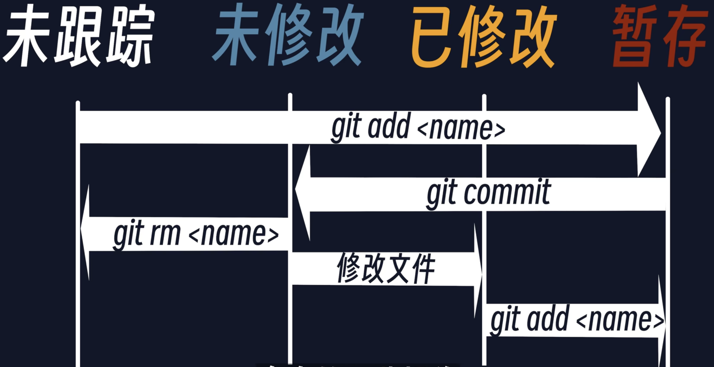
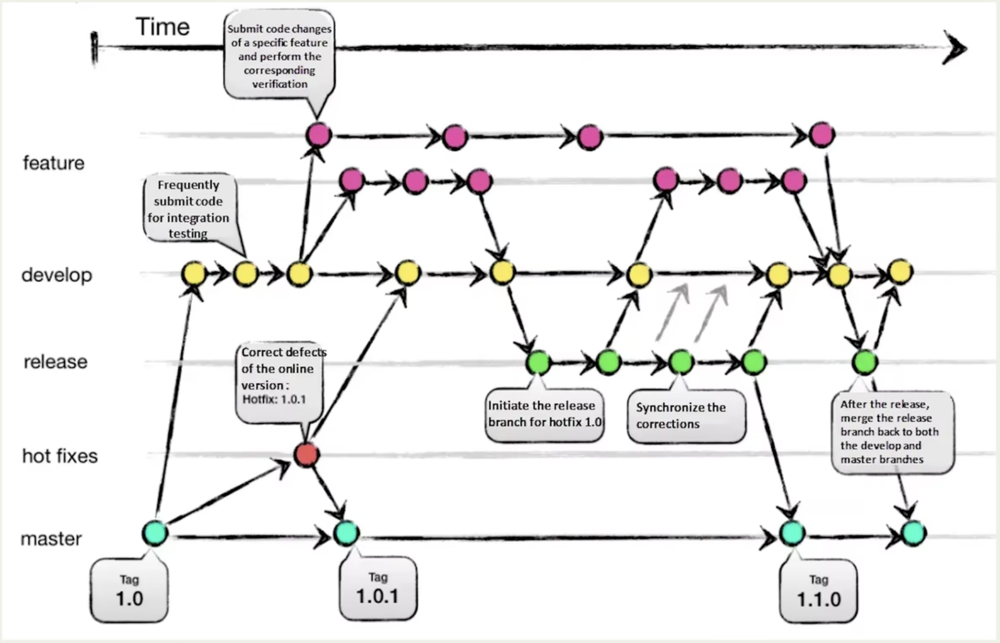

# 本地操作

| git本地操作       |                                                              |
| ----------------- | ------------------------------------------------------------ |
| git init          | 将当前文件夹变成一个git仓库, 命令执行后多了一个.git文件夹    |
| git add           | git add . 跟踪当前目录所有文件, 这里的.表示当前目录,  修改后的文件需要git add成暂存状态, 才能commit |
| git commit -m ''  | 输入本次提交的信息                                           |
| git commit -am '' | 可以把没有暂存的文件也提交                                   |
| git status        | 查看文件状态                                                 |
| git diff          | 查看详细修改信息                                             |

在你push时发现已经有人push过, 也就是说你落后一个版本并做了修改, 你需要用下面这个命令回到你commit之前, 更新版本(使用pull), 再重新commit

git reset head --soft回退一个版本撤销commit, head相当于上次的提交, head相当于当前的提交; -- soft只撤销提交, add设置文件暂存状态还是存在, 不加代表暂存状态没有

**日志**

git log --pretty=format:"%h - %an, %ad : %s" 查看日志(%h简化哈希, %an作者, %ar至今多久, %ad日期, %s提交说明)

git log --graph 图形化查看日志

git log --pretty=onelint

git log --oneline

git reflog

**如何撤销文件的修改?**

1. 未提交到暂存区即没有add
   - 单个文件撤销修改`git checkout --<filename>`
   - 撤销工作区中所有文件的修改`git checkout .`
2. 提交到了暂存区, 即add后
   1. 一次都没有commit过, `git rm --cached <file_name>`
   2. 已经commit, `git reset HEAD file_name`让该文件回到工作区的状态, `git chekcout -- file_name`回到最近的一次commit或者add

# 远程仓库

| 远程仓库相关命令     |                                                              |
| -------------------- | ------------------------------------------------------------ |
| 本地仓库链接远程仓库 | git remote add origin https://github.com/zzz-red/git_command_test.git |
| 查看                 | git remote                                                   |
| 重命名               | git remote rename <origin_name> <new_name>                   |
| 删除                 | git remote remove <name\>                                    |
| 推送                 | git push gitee_origin master                                 |

GitHub主分支main; Gitlab主分支main; Gitee主分支master; 

# 分支Branch

每次commit生成新版本都会生成一个提交对象

| 分支的命令                       |                                                            |
| -------------------------------- | ---------------------------------------------------------- |
| 查看所有分支                     | git branch --list                                          |
| 创建分支                         | git branch <branch_name>                                   |
| 切换分支                         | git checkout feature1                                      |
| 创建并切换                       | git checkout -b feature2                                   |
| 合并分支                         | git merge <branch_name> 合并当前分支和<branch_name>分支    |
| 抓取分支                         | git fetch <remote_name> <分支名>                           |
| git pull = git fetch + git merge | git pull <remote_name> <remote_branch_name> 与当前分支合并 |
| 储藏                             | git stash                                                  |
| 恢复存储的状态                   | git stash apply                                            |
| 查看所有存储                     | git stash list                                             |

 

