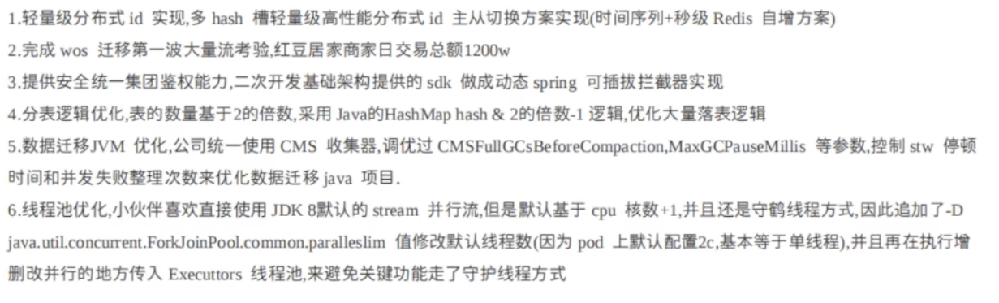
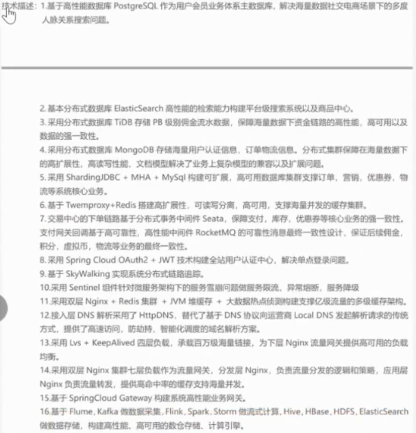
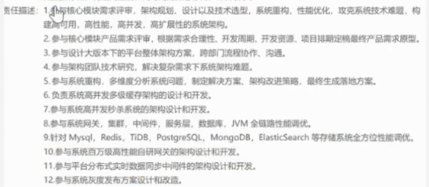

# 张子钊-Java后端工程师

微信：syrah30 |
 13133068332 |
 oz2029@126.com |
<!--  [shfshanyue](https://github.com/shfshanyue) |
 <https://shanyue.tech> -->

## 基本信息

- **姓名**：张子钊
- **性别**：男
- **出生年月**: 1999.11
- **可入职时间**：随时到岗

## 教育背景

- **2022-09 ~ 2025-06**  上海海洋大学  电子信息 (硕士)

- **2018-09 ~ 2022-06**  西南林业大学 计算机科学与技术 (本科)

## 工作经历

- **2025-3 ~ 至今**   携程计算机技术有限公司                                         后端开发实习
- **2023-10 ~ 2024-02**  上海钧正网络科技有限公司 (哈啰出行) 后端开发实习

## 技能特长

1. 精通 Java 核心技术, 设计模式, 数据结构。
2. 精通 Java 并发编程, 包括 线程池, 锁机制, AQS, ThreadLocal。
3. 精通 JVM 底层原理, 理解垃圾回收机制和类加载机制, 有JVM调优工作经验。
4. 精通 Spring, Spring MVC, Spring Boot, MyBatis, 曾深入研究核心源码。
5. 精通 MySQL, 理解事务、MVCC、索引、锁、日志, 有MySQL性能调优⼯作经验。
6. 精通 Redis, 包括核心数据结构。理解Redis IO模型, 线程模型, 内存淘汰机制, 持久化机制, 高可用机制。有解决缓存失效问题和数据一致性问题的经验。 
7. 精通 RocketMQ, 理解底层刷盘机制和集群分⽚机制, 掌握 消息丢失, 重复消费, 消息积压, 消息顺序等问题的解决⽅案, 同时熟悉Kafka和RabbitMQ。
9. 掌握 常见分布式问题的解决方案, 包括分布式锁, 分布式id, 分布式事务, 数据一致性。
8. 掌握 操作系统, 计算机网络, 计算机组成原理 的核心内容。

1. 掌握 常见分布式问题的解决方案, 包括分布式幂等, 分布式日志, 分布式定时任务, 分布式链路追踪, 分布式预警监控, 分布式数据库, 分布式搜索引擎。
2. 掌握 SpringCloud 技术体系, 对微服务特点, 旧服务改造, 服务划分, 服务治理有深入研究。
3. netty
4. ES, Nginx, Tomcat, lvs, keeplived, cdn, dns
5. docker, k8s, promethus, grafana
6. hadoop, hive, hbase, spark, flink
7. mycat, shardingsphere
8. mongodb

## 项目经验

### 消息推送平台

**简介**: 消息推送平台承接着公司对各种类型渠道的消息下发, 每天承载亿级流量推送, 支持快速发送短信, 微信, 邮件以及第三方平台应用消息等。支持公司下所有活动运营发送消息, 通过底层技术保障消息发送用户高触达率。

**承担角色**: 项目主要负责人

**技术架构**：SpringBoot + MyBatis + Kafka + Redis + Flink + Hive

**个人贡献**：

1. 使用责任链模式开发消息发送逻辑, 包括数据校验, 占位符解析, 发送MQ, 去重, 调用第三方接口等逻辑。
2. 拆分多个 RocketMQ 客户端消费者组, 实现数据隔离, 提升消息发送性能。
3. 使用 Redis + Lua脚本 实现滑动窗口算法进行消息去重。
4. 使用动态线程池提升消息发送性能, 并且可以对消费能力通过配置进行调控。
5. 实现消息的全链路追踪: 在每个关键处理的阶段上进行埋点, 将点位收集到MQ, Flink统一清洗处理。实时数据写入Redis, 离线数据写入Hive, 固化出实时和离线的统一推送基础模型。
6. 实现完备的消息管理平台基础建设: 包括系统和应用资源的监控和告警体系, 消息模板工单审核, 各种消息模板的素材管理, 规则引擎快速接入短信渠道消息。
7. 数据一致性和补偿处理：结合 MySQL BinLog 和 RocketMQ 实现异步更新缓存。
8. 分布式环境下的并发处理和分表处理：自定义雪花算法机器标识位, 解决可能出现的并发生成重复问题。

### 规则引擎

- **项目描述**: 实现Java应用无须发布上下线, 即可动态变更业务逻辑。
- **技术栈**: Groovy + 分布式配置中心Nacos + SpringBoot
- **主要工作**: 
  - Groovy脚本写在配置中心Nacos中, 借助分布式配置中心监听配置功能, 客户端实时发现Groovy脚本变更。
  - 解析Groovy脚本, 将有变化的Groovy配置重新注册到Spring IOC容器中供客户端使用。
  - 自定义Starter
  

# 自我评价

1年Java开发经验, 深入研究过JUC, Spring, Spring MVC, Mybatis, SpringBoot源码, 研究 500+ Leetcode题目, Leetcode站内排名53138。

具有分布式, 高并发, 高可用, 大数据量的系统架构设计以及研发经验, 

具有注册用户1.5亿, 日活300万, 日访问量1亿的消息平台的架构设计与研发经验

喜欢写技术博客, 目前博客访问量XX, 站内排名XX, 粉丝数XXX

