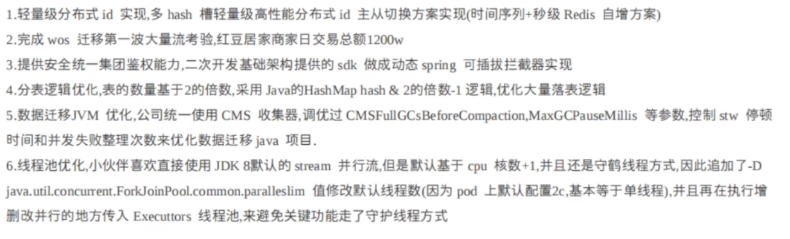
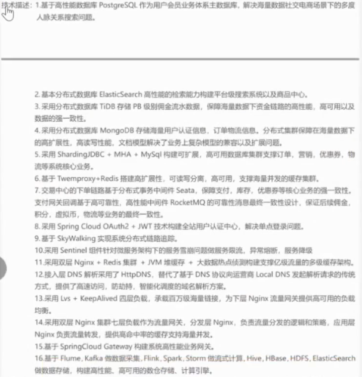
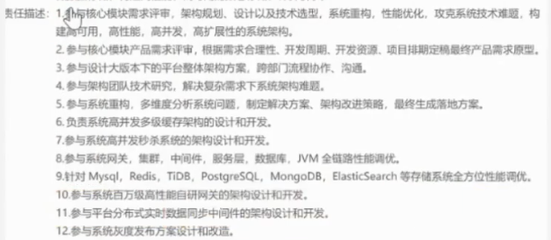

# 张子钊 - Java后端

::: left

icon:info 张子钊 男 1999.11

icon:phone 13133068332

icon:weixin syrah30

[icon:email oz2029@126.com](oz2029@126.com)

:::

::: right

:::

## 教育背景

:::left
上海海洋大学 - 计算机技术 (硕士)
:::
:::right
**2022.09 - 2025.06**
:::

:::left
西南林业大学 - 计算机科学与技术 (本科)
:::
:::right
**2018.09 - 2022.06**
:::

## 工作经历

:::left
携程计算机技术(上海)有限公司  Java后端开发工程师
:::
:::right
**2025-03 ~ 2025-10**
:::

:::left
上海钧正网络科技有限公司(哈啰出行)  Java开发实习
:::
:::right
**2023-10 ~ 2024-02**
:::

## 项目经验

### 消息推送平台

**简介**: 消息推送平台承接着公司对所有类型的消息下发, 每天承载百万流量推送, 支持快速发送短信, 邮件以及APP通知等消息, 同时支持公司所有活动发送消息, 也同时负责对内网的告警和通知消息发送, 通过底层技术保障消息发送用户高触达率。

**技术架构**: SpringBoot + MySQL + MQ + Redis + 定时任务

**项目介绍:**:

1. 使用责任链模式开发消息发送逻辑, 包括数据校验, 占位符解析, 发送MQ, 去重, 调用第三方接口等逻辑。
2. 拆分多个 MQ 消费者组, 实现数据隔离, 提升消息发送性能。
3. 使用 Redis + Lua 实现滑动窗口算法限流以及幂等。
4. 使用动态线程池提升消息发送性能, 可对消费能力通过配置进行调控。
5. 定时任务实现定时发送, 夜间屏蔽等功能。
6. 实现消息的全链路追踪, 在关键处理阶段埋点, 将点位收集到MQ, 用于生成数据报表。
7. 实现完备的消息平台基础建设, 包括系统和应用资源的监控和告警体系, 消息模板管理。

### 携程售后客服单据系统

**简介**: 携程售后客服系统系统围绕客服处理复杂订单事件的完整工作流进行设计, 核心集成回复客人, 自动化回复, 暂缓处理, 催办及请求他人协助等关键功能, 实现了售后服务的标准化, 流程化与智能化。

**技术架构**: SpringBoot + MySQL + MQ + Redis + 定时任务

**个人贡献**:

1. 负责核心表结构设计，兼顾业务扩展性与查询性能。
2. 使用模板方法设计模式开发业务接口。
3. 使用MQ消息, 任务表的方式实现全部流程异步化。
4. 整合多系统操作，实现统计业务指标(到我为止率)全流程闭环。

## 技能特长

1. 精通 Java 核心技术, 设计模式, 数据结构。
2. 精通 Java 并发编程, 包括 线程池, 锁机制, AQS, ThreadLocal。
3. 精通 JVM 底层原理, 理解垃圾回收机制和类加载机制, 有JVM调优工作经验。
4. 精通 Spring, Spring Boot, MyBatis, 曾深入研究核心**源码**。
5. 精通 MySQL, 理解事务、MVCC、索引、锁、日志, 有MySQL性能调优⼯作经验。
6. 精通 Redis, 包括核心数据结构。理解Redis IO模型, 线程模型, 内存淘汰机制, 持久化机制, 高可用机制。 
7. 精通 MQ, 理解底层读写原理, 底层刷盘机制和集群分⽚机制, 掌握 消息丢失, 重复消费, 消息积压, 保证消息顺序等问题的处理⽅案。
8. 掌握 常见分布式问题的解决方案, 包括分布式锁, 分布式id, 分布式事务, 数据一致性。
9. 掌握 操作系统, 计算机网络, 计算机组成原理 的核心内容。

## 自我评价

1. 1年Java开发经验, 深入研究过JUC, Spring, SpringBoot, Mybatis源码, 研究 500+ Leetcode题目, Leetcode站内排名53138。
2. 有良好的英语读写能力, 攻读硕士学位期间发表了CCF国际会议(SMC 2024: International Conference on Systems, Man, and Cybernetics)论文。

1. 掌握 常见分布式问题的解决方案, 包括 分布式日志, 分布式定时任务, 分布式链路追踪, 分布式预警监控, 分布式数据库, 分布式搜索引擎。
2. 掌握 SpringCloud 技术体系, 对微服务特点, 旧服务改造, 服务划分, 服务治理有深入研究。
3. netty
4. ES, Nginx, Tomcat, lvs, keeplived, cdn, dns
5. docker, k8s, promethus, grafana
6. hadoop, hive, hbase, spark, flink
7. mycat, shardingsphere
8. mongodb

## 项目经验

### 消息推送平台

**简介**: 消息推送平台承接着公司对各种类型渠道的消息下发, 每天承载亿级流量推送, 支持快速发送短信, 微信, 邮件以及第三方平台应用消息等。支持公司下所有活动运营发送消息, 通过底层技术保障消息发送用户高触达率。

**承担角色**: 项目主要负责人

**技术架构**：SpringBoot + MyBatis + Kafka + Redis + Flink + Hive

**个人贡献**：

1. 使用责任链模式开发消息发送逻辑, 包括数据校验, 占位符解析, 发送MQ, 去重, 调用第三方接口等逻辑。
2. 拆分多个 RocketMQ 客户端消费者组, 实现数据隔离, 提升消息发送性能。
3. 使用 Redis + Lua脚本 实现滑动窗口算法进行消息去重。
4. 使用动态线程池提升消息发送性能, 并且可以对消费能力通过配置进行调控。
5. 实现消息的全链路追踪: 在每个关键处理的阶段上进行埋点, 将点位收集到MQ, Flink统一清洗处理。实时数据写入Redis, 离线数据写入Hive, 固化出实时和离线的统一推送基础模型。
6. 实现完备的消息管理平台基础建设: 包括系统和应用资源的监控和告警体系, 消息模板工单审核, 各种消息模板的素材管理, 规则引擎快速接入短信渠道消息。
7. 数据一致性和补偿处理：结合 MySQL BinLog 和 RocketMQ 实现异步更新缓存。
8. 分布式环境下的并发处理和分表处理：自定义雪花算法机器标识位, 解决可能出现的并发生成重复问题。

### 规则引擎

- **项目描述**: 实现Java应用无须发布上下线, 即可动态变更业务逻辑。
- **技术栈**: Groovy + 分布式配置中心Nacos + SpringBoot
- **主要工作**: 
  - Groovy脚本写在配置中心Nacos中, 借助分布式配置中心监听配置功能, 客户端实时发现Groovy脚本变更。
  - 解析Groovy脚本, 将有变化的Groovy配置重新注册到Spring IOC容器中供客户端使用。
  - 自定义Starter
  

# 自我评价

1年Java开发经验, 深入研究过JUC, Spring, Spring MVC, Mybatis, SpringBoot源码, 研究 500+ Leetcode题目, Leetcode站内排名53138。

具有分布式, 高并发, 高可用, 大数据量的系统架构设计以及研发经验, 

具有注册用户1.5亿, 日活300万, 日访问量1亿的消息平台的架构设计与研发经验

喜欢写技术博客, 目前博客访问量XX, 站内排名XX, 粉丝数XXX

